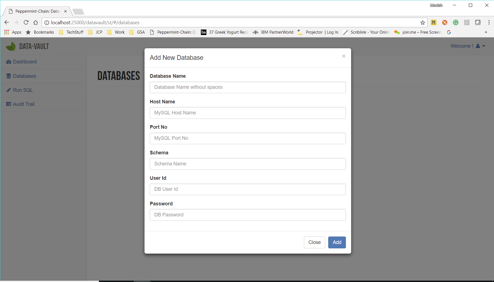
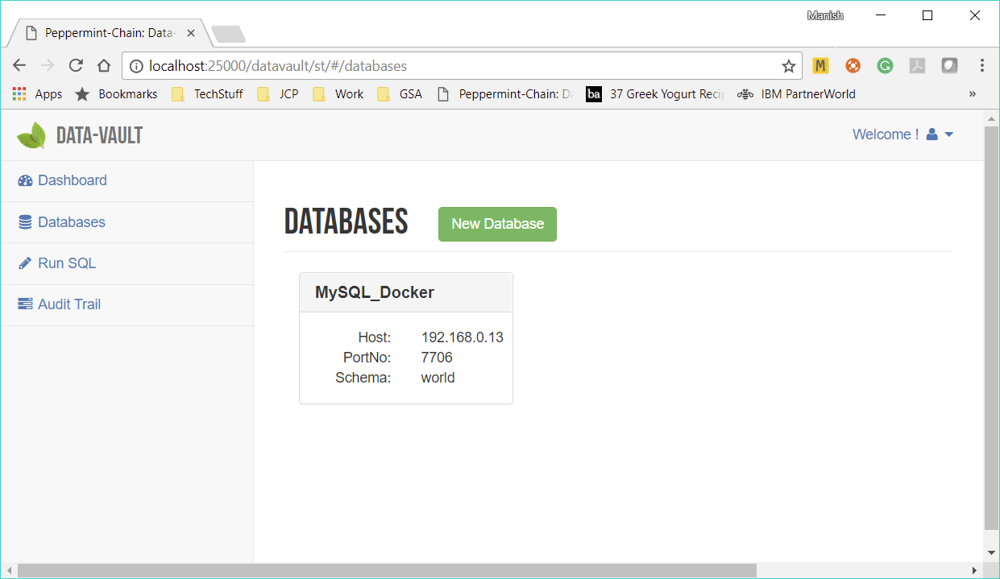
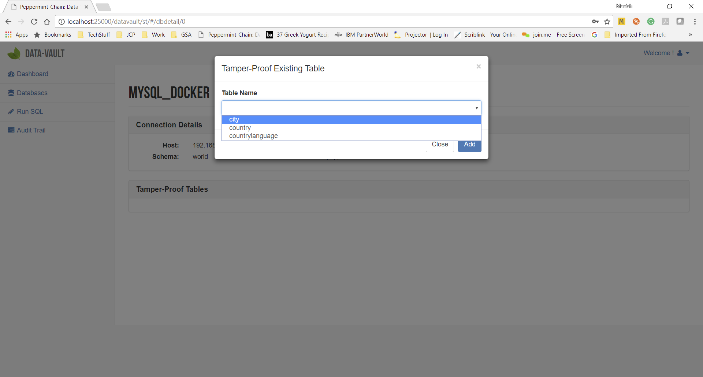
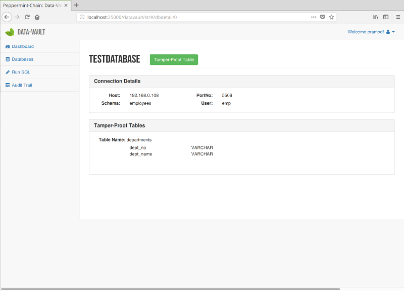

=====================
Configure Data-Vault
=====================

The Configuration UI is accessible at :code:`http://localhost:<port>/datavault/st/index.html`, 
where **port** is the port no that was passed in the :code:`docker run` command.

The steps for configuring Data-Vault are very simple.

1. Add the database which contains the tables that you would like to make Tamper-Proof.
2. Pick the tables you want to make Tamper-Proof. 

In the examples below we will use the **MySQL Employees Database** to showcase the features of the Data-Vault.

Add Database
=============

Currently the Data-Vault only supports MySQL as a source of data. The databases that are in the pipeline are

1. Postgres SQL
2. SQL Server
3. Oracle

Pre-Requisites to Adding a MySQL database
------------------------------------------

In order to make the data in a MySQL database Tamper-Proof the mandatory requirement is to have a 
**User Id** that has been configured with the following privileges

1. REPLICATION_CLIENT
2. REPLICATION_SLAVE

Adding a MySQL database
-----------------------
To add a new Database to the Data-Vault. First navigate to the **Databases** section from the left bar.

You should see the list of configure databases in the system. 

.. image:: images/blank_databases.png
	:scale: 90%
	
To add a new database click on the **New Database** button. This should bring up the ** Add Database ** popup.

	

Enter the following.

1. **Database Name:** A Database name. This should not contain spaces.
   
2. **Host Name:** Enter the hostname/ipaddress for MySQL. Due to the way docker works **localhost** is not a valid option. 
   If your **MySQL** server runs on the same machine, **please enter the external ip-address of the host.** 
   A quick way to find your external IP address was covered in the Setup Sample MySQL sections. For more details see `Find IP Address <setup_mysql_win.html#find-ip-address>`_.

3. **Port no:** The **MySQL** port no. The default is **3306** which we have used in the example windows MySQL installation. 
   The example docker MySQL installation uses the port **7706**.

4. **Schema:** The **MySQL** database/schema which contains the tables you want to make Tamper-Proof. Our examples use the schema **"world"**.

5. **User Id:** The user id you would like the Data-Vault to use to connect. Please ensure that this user-id has the 
   ** REPLICATION_CLIENT & REPLICATION_SLAVE ** privileges. Our example databases use the user **"peppermint"**.
  
6. **Password:** The password for the user-id specified. Our example databases use the password **"peppermint"**.
   Currently in the alpha version this is stored in clear-text but we will make the password secured by the Beta version.

Click **Add** to add the database.

You should now see the **Databases** section with the new **Database**.

 
Click on the **database name** to see the details of the newly added database.

Tamper-Proof Table Setup
-------------------------
Now that you have added a database. The next step is to select the tables in the database 
which you would like made **Tamper-Proof**.

Click the **Tamper-Proof Table** button to select a table to Tamper-Proof.

This should bring up a dialog which lists all the tables in the selected Schema.

	
Select the table you want to make Tamper-Proof and click **Add**.
At this point the Data-Vault will make a copy of all the rows in the table. 
It might take a little while for the popup to disappear depending on how many rows are in the table. 

Once Data-Vault has copied the data you should be able to see the table configured under the database as shown below.

	
