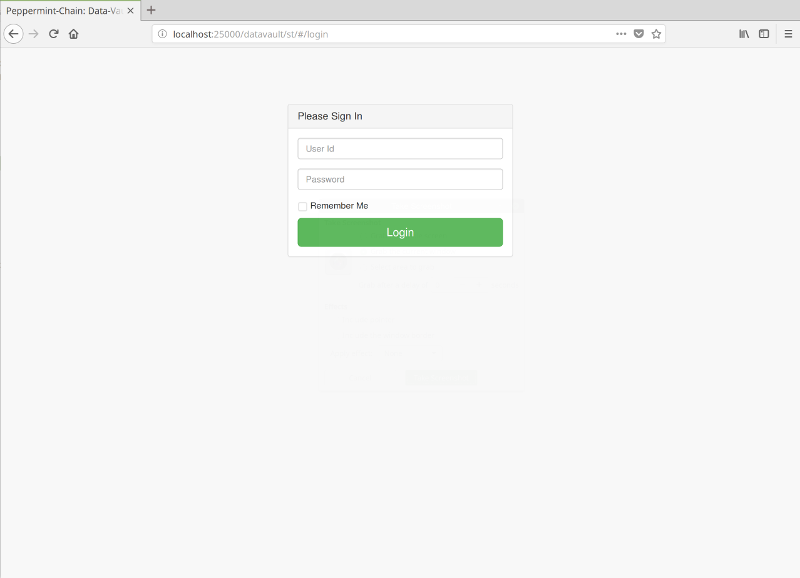
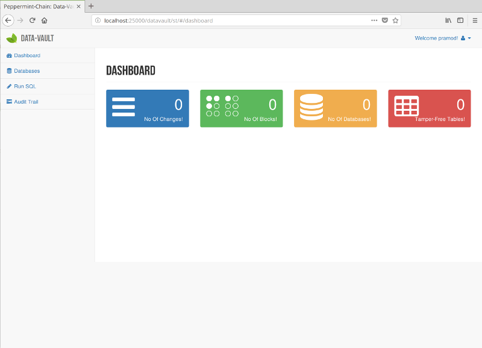

============================
Download and run Data-Vault
============================

Download
============
The Data-Vault is distributed as docker image on **Docker Hub** with the tag :code:`peppermint-chain/data-vault`.

To download **Data-Vault** the command is 

.. code-block:: bash

	> docker pull peppermintchain/data-vault
	

Run
=======
The Data-Vault docker image needs two mandatory arguments to be passed when being started. 

State
------
The Data-Vault docker image is designed to use the host file-system to save its state. 
Therefore it needs some arguments to be passed to the docker command to mount a local directory/folder into
the docker image.

Ports
------
The Data-Vault also exposes its UI using an embedded HTTP server. The port for this HTTP server needs to be 
proxied to the docker host before it can be accessed.

Syntax
-------

.. code-block:: bash

	> docker run -v <data-directory-on-host>:/usr/local/peppermint-chain/data \
		-p <host-port>:25000 -d peppermintchain/data-vault

		<data-directory-on-host>: This is the full path to the directory on the host 
				where you want the data-vault to save its state.
		<host-port>: This is the port no on the host where you want to access the 
				Data-Vault's UI.

A typical command to start the Data-Vault would look like

.. code-block:: bash

	> docker run -v /home/pramod/data-vault:/usr/local/peppermint-chain/data \
		-p 25000:25000 -d peppermintchain/data-vault
	

When run with the above command

	1. The Data-Vault will save its state under :code:`/home/pramod/data-vault`.
	2. The UI will be accessible on port :code:`25000`.

Verify Install
===============
Once the docker container has been started. Navigate to the URL 

`<http://localhost:25000/datavault/st/index.html>`_.

You should see the **Login** screen.

Login
--------

In the alpha version there is no Authentication. Just login with any User Id.

Dashboard
----------
Once you login, you should see the main Dashboard

The Dashboard gives a high level view of the current state of the Data-Vault.
When you first login, it should look like the image above.

If you are able to see the Dashboard, you are good to go !