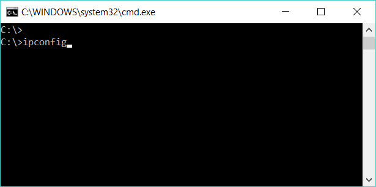
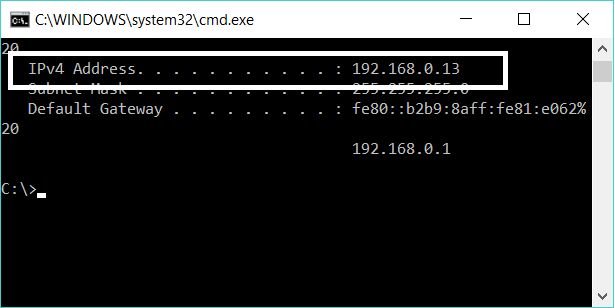
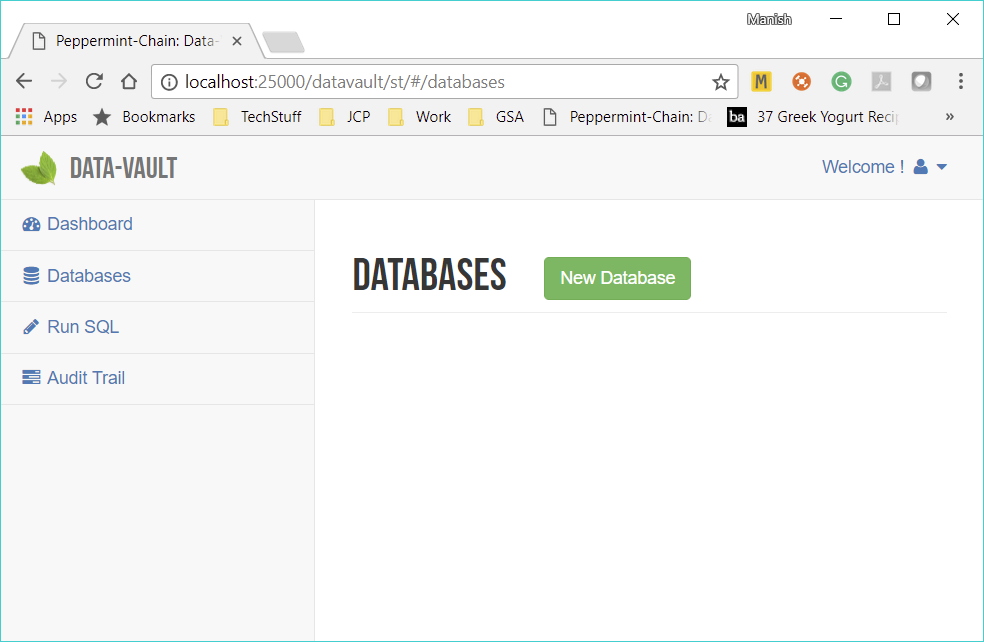
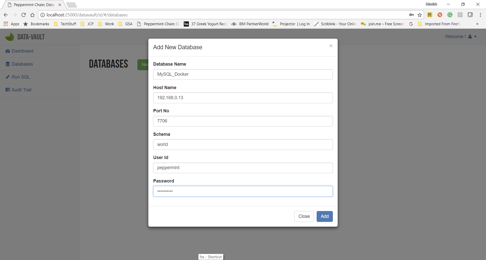

============
Docker MySQL
============

Prerequisites
=============
Before beginning the MySQL installation, please decide on a directory where the MySQL data and configuration files will reside.
For this exercise, lets use the directory c:\mysql.

Docker MySQL Installer
======================
We will be using the published MySQL Docker image from https://hub.docker.com/_/mysql/

To begin installing, open the command prompt by going to Start -> Windows System --> Command Prompt
You can also open the command prompt by running the command (CTRL-R) "cmd"

Once the black command prompt window is open, give the following commands one after another in sequence to:

	* Create the mysql directories
	* Create a configuration file
	* Install MySQL and Start the docker Instance for MySQL

We use the password **"test123"** but you can use a different password and replace the password in the last line below

.. code-block:: bash

	> mkdir c:\mysql && mkdir c:\mysql\conf && mkdir c:\mysql\data
	> (echo [mysqld] && echo log_bin=mysql-bin && echo server_id=1) > ./mysql.cnf
	> docker run --name testmysql -v C:\mysql\data:/var/lib/mysql -v C:\mysql\conf:/etc/mysql/conf.d -p 7706:7706 -e MYSQL_ROOT_PASSWORD=**test123** -d mysql:5.7

Configuration of MySQL 
======================
Since the Data-Vault needs to replicate data from MySQL, the MySQL Server should be setup for **Replication**.
In order to do this we will use a script to create an example database and create appropriate users with appropriate privileges

Download The Data Files
-----------------------

Download the docker_world_dump.sql file from `here <http://peppermintchain.com/_images/docker_world_dump.sql>`_ and save the file in the

**C:\\mysql\\conf**

directory that we created above

Setup Your MySQL
----------------

Run the following commands on the command prompt window one after another in a sequence to create the schema, import the example data and create the user "peppermint"

.. code-block:: bash

	> docker exec -it testmysql bash
	> mysql -u root -ptest123 < /etc/mysql/conf.d/docker_world_dump.sql

For simplicity, we kept the password for the user peppermint as "peppermint123" in the above script. Please feel free to change it.	

Find IP Address
===============

To find the IP address assigned to the machine by the router, follow the following steps:

	- Open a command prompt by going to Start -> Windows System --> Command Prompt
	- You can also start it by running the command (CTRL-R) "cmd"
	- Once the black command prompt window is open, give the following command

.. code-block:: bash

	> ipconfig
	

	
Look for the entry under the internet connectivity being used e.g. Wireless LAN adapter Wi-Fi:
The entry could look like

.. code-block:: bash

	> IPv4 Address. . . . . . . . . . . : 192.168.0.13

	
	
Save this IP address. This is the IP address with which you will ask peppermint to connect to the MySQL database

Verify MySQL Connectivity
=========================

To verify the connectivity, login to Peppermint and go to the Databases section.
Click the "New Database" button

Use the following details to add the "world" example database on our MySQL database that we just installed.

+-----------------+-------------------------------------------------------------------+
| DatabaseName    | Choose a name e.g. MySQL_Docker                                   |
+-----------------+-------------------------------------------------------------------+
| HostName        | The IP address above e.g. 192.168.0.13                            |
+-----------------+-------------------------------------------------------------------+
| PortNo          | 7706                                                              |
+-----------------+-------------------------------------------------------------------+
| Schema          | world                                                             |
+-----------------+-------------------------------------------------------------------+
| UserId          | peppermint                                                        |
+-----------------+-------------------------------------------------------------------+
| Password        | "peppermint123" or the password you setup for the peppermint user |
+-----------------+-------------------------------------------------------------------+

|

This will connect to the database and that verifies the MySQL installation and connectivity to Peppermint.
