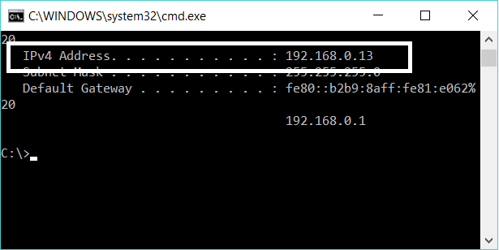

===========================
Windows Installer for MySQL
===========================

Prerequisites
=============

Before beginning the MySQL installation, please ensure that you have the following already installed on the Windows machine.

* MySQL Installer requires Microsoft .NET Framework 4.5.2 or later.
	If it is not installed on the host computer, you can download it by visiting the Microsoft web site
	`<https://www.microsoft.com/en-us/download/details.aspx?id=17113>`_.
* Microsoft Visual C++ 2010 Redistributable Package (x86)
	If the host computer does not have Visual C++, please install it from the following Microsoft site
	`<https://www.microsoft.com/en-us/download/details.aspx?id=5555>`_.

Windows MySQL Installer
=======================

After the above prerequisites have been installed, download the Community version installer from `<https://dev.mysql.com/downloads/installer/>`_.

	* Ensure that Microsoft Windows is selected in the dropdown as the operating system.
	* Download the mysql-installer-community-5.7.21.0.msi file using the download button against the **Windows (x86, 32-bit), MSI Installer**
	* To prevent connectivity complications during installation, we suggest that you choose the larger, offline version of the installer.
	* Double click the .msi file downloaded to begin the installation

Setup Type
==========

During the initial setup, you are prompted to select the MySQL products to be installed on the host. One alternative is to use a predetermined setup type that matches your setup requirements. Choosing one of the setup types determines the initial installation only and does not limit your ability to install or update MySQL products for Windows later.

To ensure you have the server, the workbench and the example databases, choose the full install.

Check Requirements
==================

MySQL Installer uses entries in the package-rules.xml file to determine whether the prerequisite software for each product is installed on the host. If and when the requirements check fails, MySQL Installer displays the Check Requirements step to help you update the host. The following figure identifies and describes the key areas of this step.

.. image:: images/CheckRequirements.png
	:scale: 90%

You should not see the workbench in the list above and hence you can click "Next"

Verify Installation
===================

Once the installation is complete, verify the installation and access to the example database "world"

	* Start the MySQL Workbench from Start-->Programs-->MySQL
	* Select the Local Instance MySQL Router to open the SQL editor
	* On the left panel, in the Schemas section, ensure that you see the schema "world"
	* Expand the schema and ensure it has the three tables city, country and countrylanguage
	* Rightclick on the table "city" and choose the first option "Select Rows - Limit 1000" to ensure the table has data.
	* Close the Workbench

Enable Replication
==================

To enable replication we need to ensure replication is enabled in My SQL. This is done in two steps

	* Enable Binary Logging
	* Add a User with Replication Privillages
	
Enable Binary Logging
=====================

Open the file C:\ProgramData\MySQL\MySQL Server 5.7\my.cfg in a text editor like notepad++
Look for the [mysqld] section.
Add the following lines under the tag [mysqlld]

.. code-block:: bash

	# Bind Address
	bind-address="0.0.0.0"
	# For Replication
	log_bin=mysql-bin
	server_id=1

Add New User
============

Next we will add a new user. The username can be anything you want. We will use the name "peppermint" to describe the process

	- Open MySQL Workbench.
	- Double Click on "Local Instance".

|

	- In the Navigator Section on the left panel, under MANAGEMENT - select "Users and Privillages"
	- Click "Add Account" button.
	- Add the user peppermint with the default authentication type "Standard" and set a password for this user e.g. "peppermint123"

|

	* In the "Administrative Roles" tab, select "ReplicationAdmin" role.

|

	* In the "Schema Privillages" tab, Click "Add Entry" button.
	* Use the "Selected Schema" option 
	* Choose the "world" schema 
	* Use the button "Select ALL" to give this user all privileges.

|

Find IP Address
===============

To find the IP address assigned to the machine by the router, follow the following steps:

	- Open a command prompt by going to Start -> Windows System --> Command Prompt
	- You can also start it by running the command (CTRL-R) "cmd"
	- Once the black command prompt window is open, give the following command

.. code-block:: bash

	> ipconfig
	

.. image:: images/ipconfig1.png
	:scale: 100%
	
Look for the entry under the internet connectivity being used e.g. Wireless LAN adapter Wi-Fi:
The entry could look like

.. code-block:: bash

	> IPv4 Address. . . . . . . . . . . : 192.168.0.13

	
	
Save this IP address. This is the IP address with which you will ask peppermint to connect to the MySQL database

Verify MySQL Connectivity
=========================

To verify the connectivity, login to Peppermint and go to the Databases section.
Click the "New Database" button

.. image:: images/Peppermint1.png
	:scale: 100%

Use the following details to add the "world" example database on our MySQL database that we just installed.

+-----------------+---------------------------------------------------------------------------------+
| DatabaseName    | Choose a name e.g. MySQL_Windows                                                |
+-----------------+---------------------------------------------------------------------------------+
| HostName        | The IP address above e.g. 192.168.0.13                                          |
+-----------------+---------------------------------------------------------------------------------+
| PortNo          | 3306                                                                            |
+-----------------+---------------------------------------------------------------------------------+
| Schema          | world                                                                           |
+-----------------+---------------------------------------------------------------------------------+
| UserId          | peppermint                                                                      |
+-----------------+---------------------------------------------------------------------------------+
| Password        | peppermint123 or the password you setup during the "Add New User" section above |
+-----------------+---------------------------------------------------------------------------------+

.. image:: images/Peppermint2.png
	:scale: 100%

|

This will connect to the database and that verifies the MySQL installation and connectivity to Peppermint.

