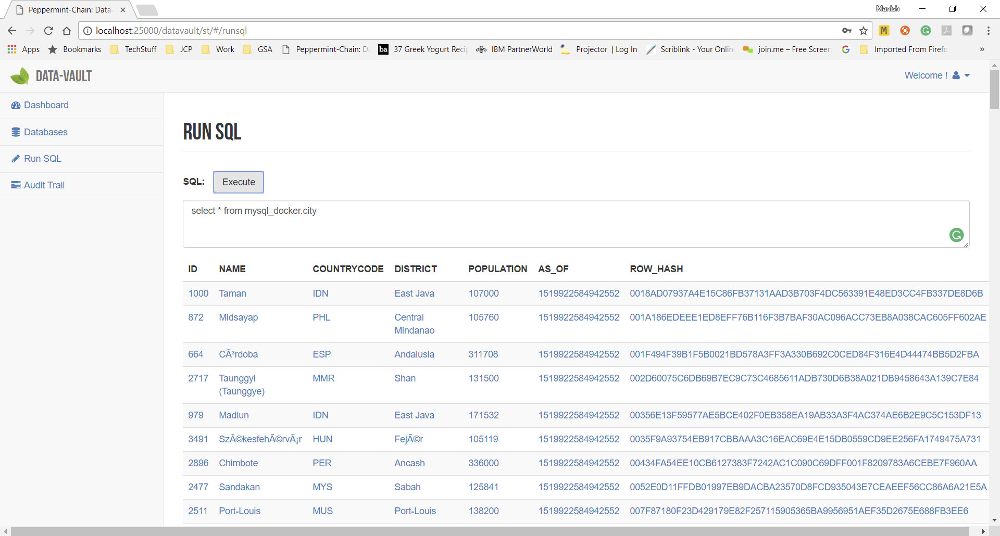
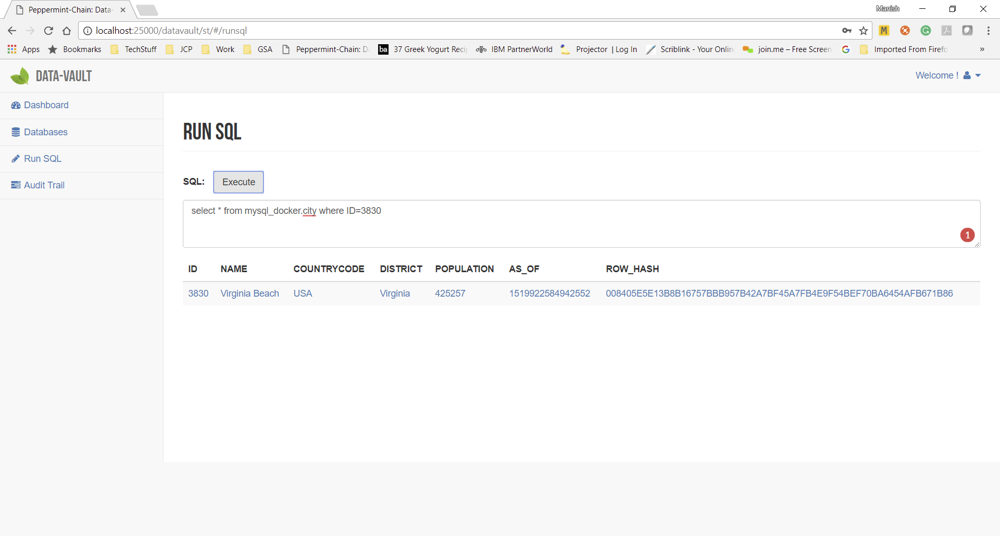
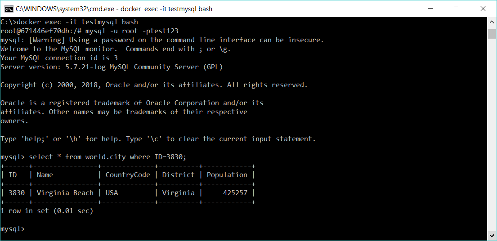
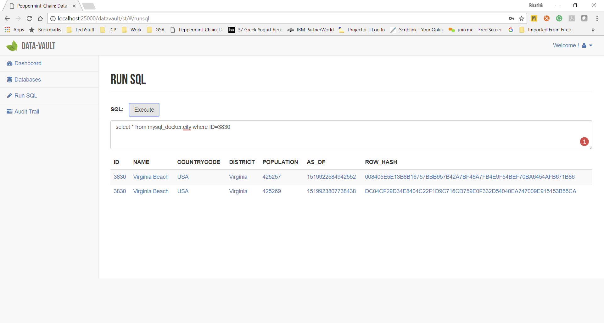
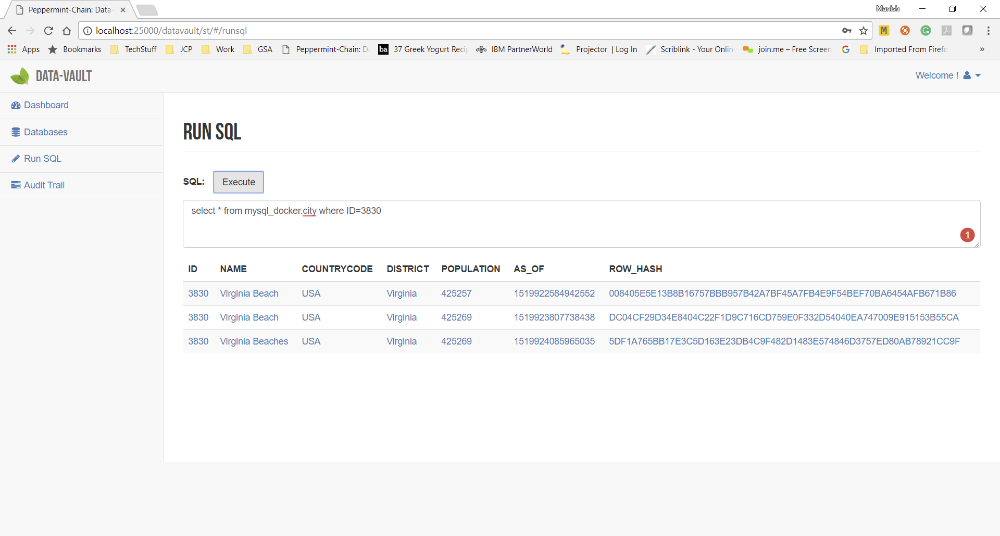

Verify Replication
===================

When a table has been setup in the Data-Vault to be made Tamper-Proof, Data-Vault will start replicating 
all changes from the database to the Data-Vault.

Let's see how to do this.

For this example we have already setup a database **MySQL_Docker** in the Data-Vault and setup the
table **city** for Tamper-Proofing using the instructions in previous section :doc:`configure`.

Lets run a sql to ensure that replication is successful. run the following sql in peppermint

.. code-block:: sql

	select * from mysql_docker.city

The result would look as follows

Lets focus on one of the rows and run a sql for that one row

.. code-block:: sql

	select * from mysql_docker.city where ID=3830
	
The result would look as follows

Docker SQL Command
------------------

Lets take a segue to understand how to execute sql commands in Docker MySQL.
Use the following commands in the cmd prompt on windows to get access to the MySQL command prompt

.. code-block:: bash

	> docker exec -it testmysql bash
	> mysql -u root -ptest123
	
Now you can run the SQL commands in Docker MySQL

Making Updates
--------------
Now lets say a change is made to this row and the database now has an updated population of 425269.
For making updates to our example database, feel free to run the following sql command in MySQL Workbench or through MySQL docker sql to carry out the change

.. code-block:: sql

	update mysql_docker.city set population='425269' where ID=3830;

Peppermint will use replication and save the new value and the above sql execution will now show the original row as well as the modified row

Now lets say another change is made to this row and someone changes the name of the city to "Virginia Beaches".
For this example feel free to run the following sql command in MySQL Workbench or MySQL docker to carry out the change

.. code-block:: sql

	update mysql_docker.city set name='Virginia Beaches' where ID=3830;

Peppermint will use replication and save the new value and the above sql execution will now show the original row as well as both the changes made to the row

This demonstrates how Peppermint Data-Vault manages the various changes to the rows and does not loose any previous information.
